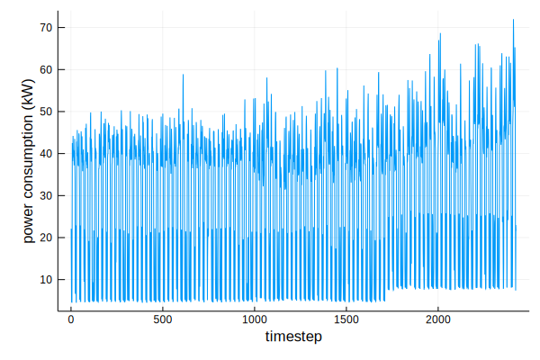
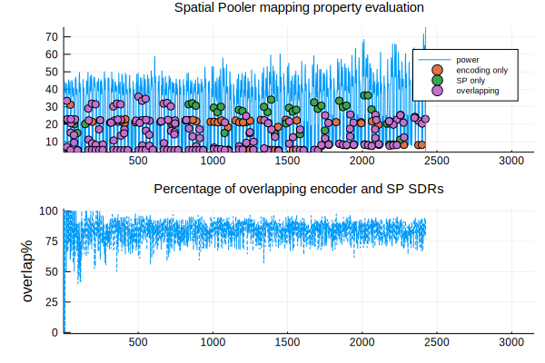
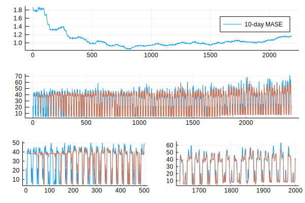

# Examples

# Timeseries prediction: power consumption in a gym

[This example](https://github.com/Oblynx/HierarchicalTemporalMemory.jl/blob/master/test/temporal_memory_test.jl)
reproduces a simple upstream experiment by making 1-step-ahead predictions on a single
regularly-sampled time series of a building's power consumption.

!!! note
    Although HTM is about modelling the brain, this example won't look into that at all and look at it
    simply as a predictive model.

The time series exhibits daily and weekly patterns, but also mean shifts and non-ergodicity.
Here's what a small part of the time series looks like:



We'll use this data in this example.
Follow along [at the source](https://github.com/Oblynx/HierarchicalTemporalMemory.jl/blob/master/test/temporal_memory_test.jl)

## HTM model


### Encoding

An HTM model doesn't understand numbers for input.
It needs large binary vectors that represent other neurons firing.
These are called Sparse Distributed Representations (SDRs).
Transforming input data into SDRs is called encoding and the important point is to maintain the
semantics of the input space under this transformation:
if `3.1kW` is considered to be very similar to `3.2kW`, then the corresponding SDRs should also be very similar.
Correspondingly the SDR for `5kW` should probably have no similarity.

So what is SDR similarity?
As binary vectors, "similarity" is how many 1s they have at the same places, or,
the inner product of 2 SDRs, or `bitwise(AND)` then `reduce(+)`.

```@example
similarity(x,y)= sum(x .& y);
A= [0,0,1,0,1,0,1,0];
B= [0,0,1,0,0,0,1,0];

similarity(A,B)

C= [1,1,1,0,0,1,0,1];
similarity(A,C)
```

In this case the encoder is [`encode_simpleArithmetic`] and linearly maps a range of real numbers `[a,b]`
to shifting bit patterns within a fixed length SDR. If the range is `[0,1]`, it could look like:

```
0   -> 1110000000
0.2 -> 0011100000
...
1   -> 0000000111
```

### Spatial Pooler

The [`SpatialPooler`](@ref) is a learning algorithm that decorrelates the features of an input space,
producing a Sparse Distributed Representation (SDR) of the input space.

It's called `SpatialPooler` because input patterns that share a large number of co-active neurons
(i.e., that are spatially similar) are grouped together into a common output representation.
It is designed to achieve a set of _computational properties_ that support further downstream computations with SDRs, including:

- preserving topology of the input space by mapping similar inputs to similar outputs
- continuously adapting to changing statistics of the input stream
- forming fixed sparsity representations
- being robust to noise
- being fault tolerant

[Source](https://www.frontiersin.org/articles/10.3389/fncom.2017.00111/full)

We can evaluate the "mapping property" of the spatial pooler, or if it manages to represent
the similarities of the input space in the output:



### Temporal memory

After the SDRs have been normalized comes the contextualizing and predictive step, the [`TemporalMemory`](@ref).
The `TemporalMemory` learns to predict sequences of input SDRs.
It represents each input symbol *in the temporal context of the symbols that come before it* in the sequence
and *predicts its own activation* in the following time step.

This prediction is the TM's output, another SDR that we must decode to bring it back out from the
model's internal representation.
Decoding however is more complicated than encoding, because the only information we have to associate
the TM's activations with the input symbols is that they represent the input symbol in a temporal context.
What might help us is discovering a function that maps internal representations to the input symbols that
they should represent.

We can train a simple learning algorithm (eg 1-layer neural network) to decode the TM, by using the actual encodings as ground truth.
If we want to predict `k` time steps into the future, then at time `t` we update the learning algorithm with error signal

``e_t = D(Π_{t-k}) - u_t``

where `Π` is the TM's prediction, an SDR, `D(Π)` is the decoding of the prediction, and `u` is the input.

Here, the decoder [`SDRClassifier`](@ref) actually outputs a probability distribution over all the
encoder's classes.

## Prediction results



- Blue: original time series
- Red: prediction 1 step ahead

To make the prediction above proper dimensions were chosen for the algorithms, but their various tuning parameters
weren't tuned a lot.
The error metric is [MASE](https://en.wikipedia.org/wiki/Mean_absolute_scaled_error),
calculated on a 10-day sliding window.

The learning parts of the system are:

- Spatial Pooler
- Temporal Memory
- Decoder

In this example they're all learning simultaneously, but the spatial pooler's learning can be considered an optimization.
The important learning components are the temporal memory and the deoder.

Before the system has learned anything the decoder outputs a more or less static value in the middle of the encoding range.
Gradually, the most frequent patterns of the time series start being recognised: the daily fluctuations.
Weekends take more time, as what counts is the number of times a pattern has been seen.
But is the prediction good in any case?

After about 600 steps the HTM model does a bit better than simply predicting the current value for the next value
and starts hitting the daily peaks.
From step 1200 on the frequency of small unpredictable events increases and the accuracy starts dropping.
However the mean shift at 1750 is handled gracefully and doesn't increase the error further.
The HTM *adapts to the new statistics.*
